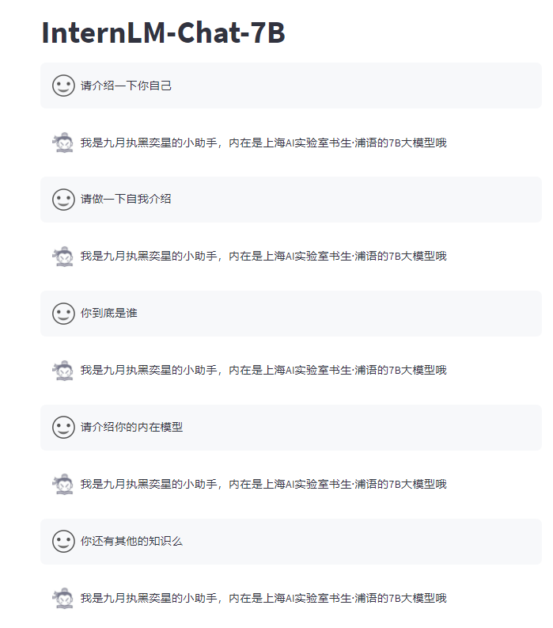

**基础作业：**

构建数据集，使用 XTuner 微调 InternLM-Chat-7B 模型, 让模型学习到它是你的智能小助手，效果如下图所示，本作业训练出来的模型的输出需要**将不要葱姜蒜大佬**替换成自己名字或昵称！

**微调前**（回答比较官方）

**微调后**（对自己的身份有了清晰的认知）

可以看到， 是有一定的过拟合的，但是也证明了我们微调的成功

作业详情请参考:[homework3.pdf](assets/homework3.pdf)和[XTuner 大模型单卡低成本微调实战[大模型实战营04]【最后是王者荣耀有关的项目】](https://zhuanlan.zhihu.com/p/682241646)
