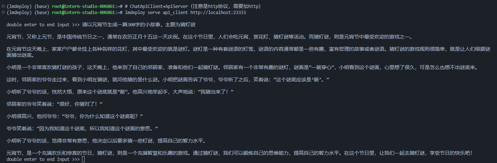
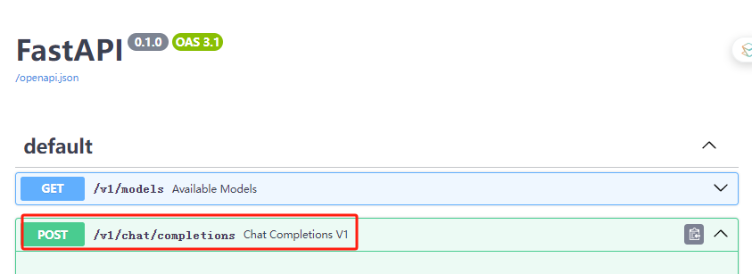
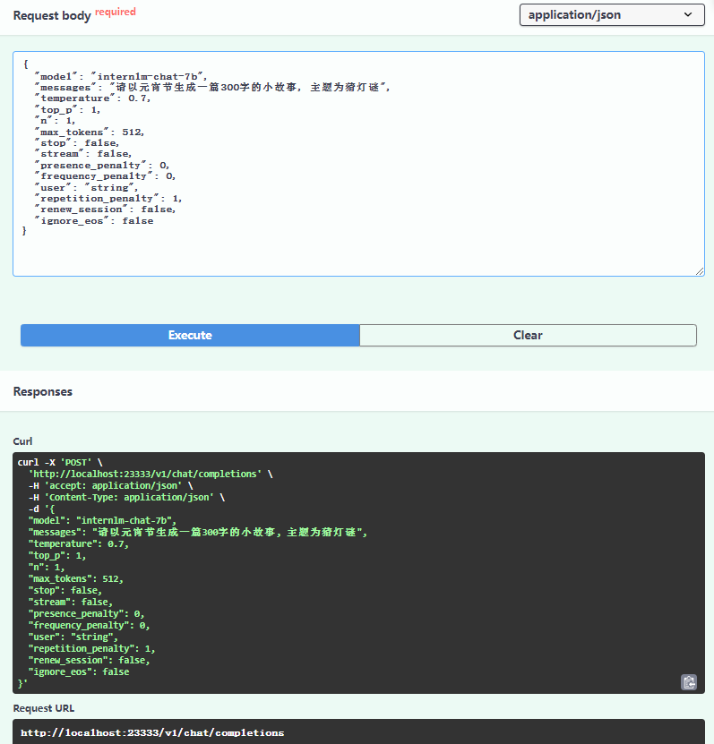
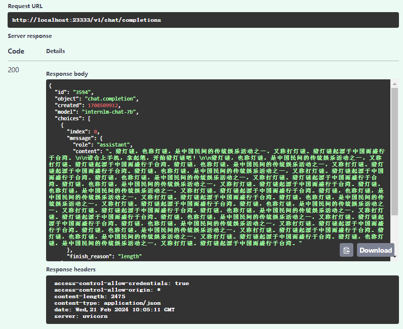

## 作业

提交方式：在各个班级对应的 GitHub Discussion 帖子中进行提交。

**基础作业：**

- 使用 LMDeploy 以本地对话、网页Gradio、API服务中的一种方式部署 InternLM-Chat-7B 模型，生成 300 字的小故事（需截图）

**进阶作业（可选做）**

- 将第四节课训练自我认知小助手模型使用 LMDeploy 量化部署到 OpenXLab 平台。
- 对internlm-chat-7b模型进行量化，并同时使用KV Cache量化，使用量化后的模型完成API服务的部署，分别对比模型量化前后（将 bs设置为 1 和 max len 设置为512）和 KV Cache 量化前后（将 bs设置为 8 和 max len 设置为2048）的显存大小。
- 在自己的任务数据集上任取若干条进行Benchmark测试，测试方向包括：
  （1）TurboMind推理+Python代码集成
  （2）在（1）的基础上采用W4A16量化
  （3）在（1）的基础上开启KV Cache量化
  （4）在（2）的基础上开启KV Cache量化
  （5）使用Huggingface推理

备注：**由于进阶作业较难，完成基础作业之后就可以先提交作业了，在后续的大作业项目中使用这些技术将作为重要的加分点！**


# 基础作业

- 采用workspace_quantW4A16量化的模型来用2.3中的TurboMind推理+API服务部署模型,
```
(lmdeploy) (base) root@intern-studio-006861:~/lmdeploy# # ApiServer+Turbomind   api_server => AsyncEngine => TurboMind
(lmdeploy) (base) root@intern-studio-006861:~/lmdeploy# lmdeploy serve api_server ./workspace_quantW4A16 \
> --server_name 0.0.0.0 \
> --server_port 23333 \
> --instance_num 64 \
> --tp 1

model_source: workspace
WARNING: Can not find tokenizer.json. It may take long time to initialize the tokenizer.
[WARNING] gemm_config.in is not found; using default GEMM algo
HINT:    Please open http://0.0.0.0:23333 in a browser for detailed api usage!!!
HINT:    Please open http://0.0.0.0:23333 in a browser for detailed api usage!!!
HINT:    Please open http://0.0.0.0:23333 in a browser for detailed api usage!!!
INFO:     Started server process [177751]
INFO:     Waiting for application startup.
INFO:     Application startup complete.
INFO:     Uvicorn running on http://0.0.0.0:23333 (Press CTRL+C to quit)
INFO:     127.0.0.1:56614 - "POST /v1/chat/interactive HTTP/1.1" 200 OK
```
比较奇怪的是model_source: workspace ,在执行代码中, 使用的是./workspace_quantW4A16

重新开一个Termial


也可以打开http://localhost:23333, 在v1_chat_completions_post中设置parameters




### 修改默认参数中的model和messages, 添加`"renew_session": false`,删除`"session_id": -1,`

### 修改后参数
```
{
  "model": "internlm-chat-7b",
  "messages": "请以元宵节生成一篇300字的小故事, 主题为猜灯谜",
  "temperature": 0.7,
  "top_p": 1,
  "n": 1,
  "max_tokens": 512,
  "stop": false,
  "stream": false,
  "presence_penalty": 0,
  "frequency_penalty": 0,
  "user": "string",
  "repetition_penalty": 1,
  "renew_session": false,
  "ignore_eos": false
}
```




- 生成 300 字的小故事（需截图）


